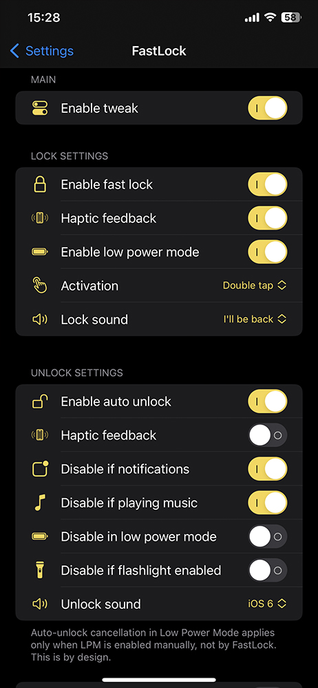

# FastLock
<li>Lock your screen using gestures on SpringBoard</li>
<li>Supports Rootful, Rootless and Roothide jailbreaks</li>
<li>Tested on iOS 14.8 (Rootful), iOS 16.4.1 (Rootless) and iOS 16.5 (Roothide). Settings can be configured in iOS Preferences</li>

## Screenshots
<table>
   <tr>
      <td></td>
   </tr>
</table>

## Installation
- Install from [My repo](https://dvntm0.github.io/#jb)
- Download from the [Releases page](https://github.com/dayanch96/FastLock/releases)
